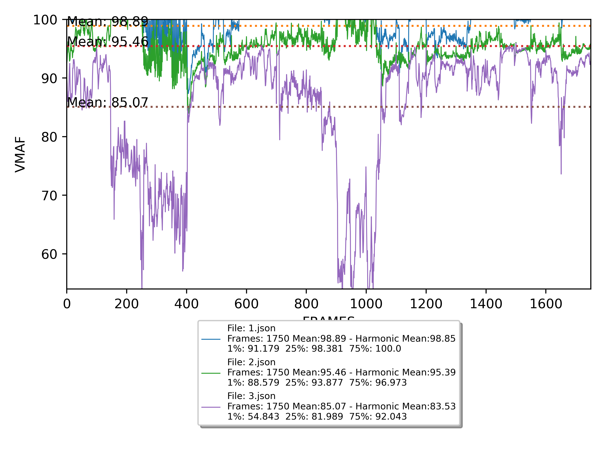

# Plot_Vmaf
Simple script for vmaf plotting.


## Usage
```bash
python plot_vmaf.py [-h] [-o OUTPUT] vmaf_file
```

## Example
```bash
python plot_vmaf.py vmaf.json -o plot.svg
```

## Options
```
-o --output ["file"]    Graph output file, file extension will change type of output (default plot.png)
```

## Requirements
Python 3
Matplotlib
Numpy
